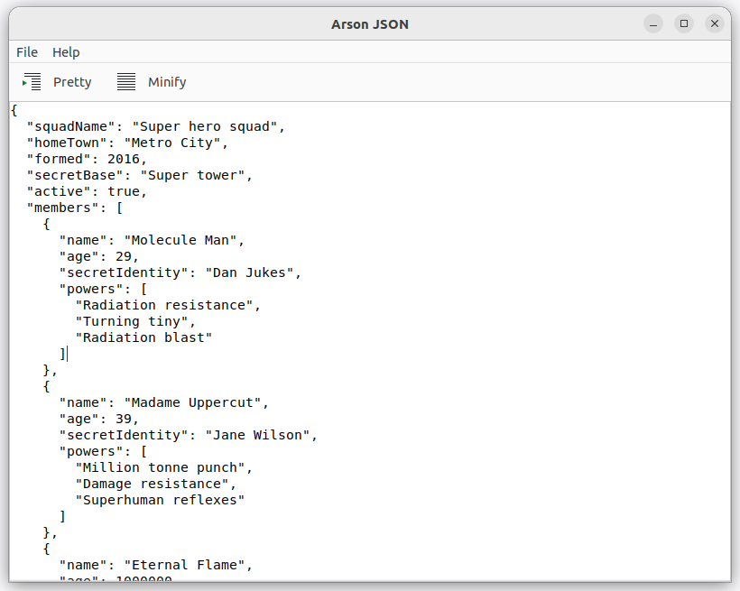

# 🔥 Arson

**A**sgrim's **R**ust-based J**SON** viewer tool.

This is a GTK3-based UI to view and manipulate JSON.

## Features

 * Minify and Pretty JSON
 * Open JSON from a file, or URL
 * Remove double `\n\n` (useful for pasting from some HAR files/logs etc)
 * Tree view for helpful navigation
